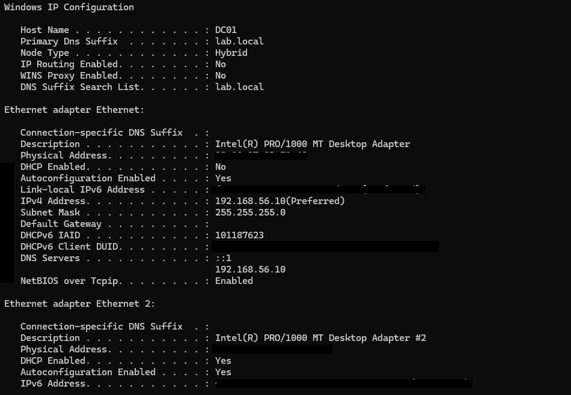
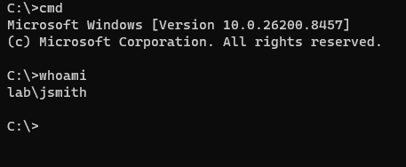
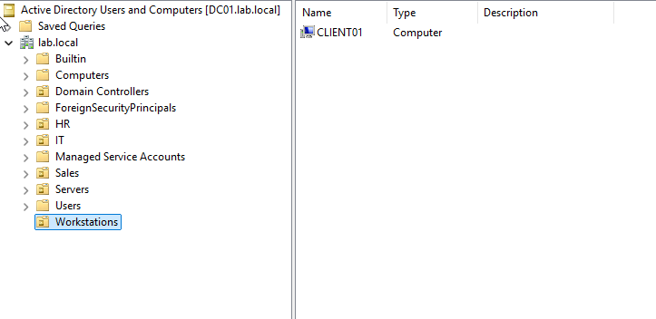
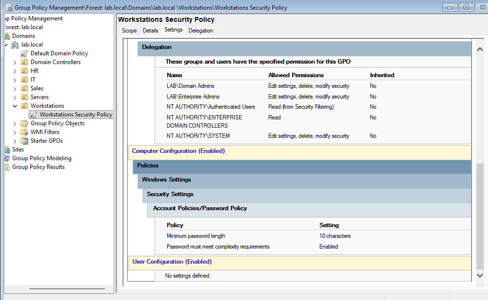
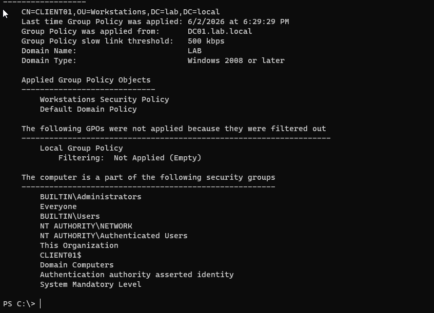

# Active Directory Lab

## Overview

This project documents the deployment and administration of a Windows Server 2025 Active Directory environment built in Oracle VirtualBox. The lab demonstrates core Windows Server administration skills including Active Directory Domain Services (AD DS), DNS, Organizational Units (OUs), Group Policy Objects (GPOs), domain user management, workstation domain joins, and troubleshooting.

---

## Lab Architecture

### Domain Controller

| Setting          | Value                                 |
| ---------------- | ------------------------------------- |
| Hostname         | DC01                                  |
| Operating System | Windows Server 2025                   |
| Domain           | lab.local                             |
| IP Address       | 192.168.56.10                         |
| Roles            | Active Directory Domain Services, DNS |

### Client Workstation

| Setting          | Value          |
| ---------------- | -------------- |
| Hostname         | CLIENT01       |
| Operating System | Windows 11 Pro |
| Domain Joined    | Yes            |
| IP Address       | 192.168.56.20  |
| DNS Server       | 192.168.56.10  |

---

## Network Diagram

```text
                     +----------------+
                     |      DC01      |
                     | Windows Server |
                     | AD DS + DNS    |
                     | 192.168.56.10  |
                     +--------+-------+
                              |
                              |
                    Host-Only Network
                         192.168.56.0/24
                              |
                              |
                     +--------+-------+
                     |    CLIENT01    |
                     | Windows 11 Pro |
                     | 192.168.56.20  |
                     +----------------+
```

---

## Technologies Used

* Windows Server 2025
* Windows 11 Pro
* Oracle VirtualBox
* Active Directory Domain Services (AD DS)
* DNS
* Group Policy Management
* PowerShell
* Command Prompt

---

# Active Directory Configuration

## Organizational Units

Created Organizational Units (OUs) to logically separate users, computers, and administrative resources:

* IT
* HR
* Sales
* Servers
* Workstations

## Example User Accounts

| Username | Department |
| -------- | ---------- |
| jsmith   | IT         |
| mjones   | HR         |

---

# Screenshots

## Domain Controller Network Configuration

DC01 was configured with a static IP address and DNS services to support Active Directory Domain Services (AD DS) and domain authentication within the lab environment.

- Hostname: DC01
- Domain: lab.local
- IPv4 Address: 192.168.56.10
- DNS Server: 192.168.56.10



---

## Domain User Authentication

Successful authentication to the domain using a domain user account.



---

## Active Directory Organizational Units

Organizational Units were created to organize users, computers, and administrative resources.



---

## Group Policy Configuration

A Group Policy Object (GPO) named **Workstations Security Policy** was created and linked to the Workstations OU.

Configured settings:

* Minimum Password Length: 10 Characters
* Password Complexity Requirements: Enabled



---

## Group Policy Verification

Group Policy application was validated using:

```powershell
gpresult /scope computer /r
```

Verified Policies:

* Workstations Security Policy
* Default Domain Policy



---

# Validation

## Connectivity Verification

```cmd
ping 192.168.56.10
```

Result:

```text
0% packet loss
```

## DNS Verification

```cmd
nslookup lab.local
```

Result:

```text
lab.local
192.168.56.10
```

## Domain Join Verification

CLIENT01 successfully joined:

```text
lab.local
```

Verified through successful domain authentication and Group Policy application.

---

# Group Policy Management

Created and deployed:

```text
Workstations Security Policy
```

Policy Settings:

* Password Complexity Enabled
* Minimum Password Length: 10 Characters

Verified using:

```powershell
gpresult /scope computer /r
```

Applied Policies:

* Workstations Security Policy
* Default Domain Policy

---

# Troubleshooting

## Issue: CLIENT01 Unable to Reach Domain Controller

### Symptoms

* Ping failures
* DNS resolution failures
* Domain join unsuccessful

### Root Cause

Incorrect network configuration on CLIENT01.

### Resolution

Configured static network settings:

```text
IP Address: 192.168.56.20
Subnet Mask: 255.255.255.0
DNS Server: 192.168.56.10
```

### Outcome

* Successful network connectivity
* Successful DNS resolution
* Successful domain join

---

## Issue: Windows 11 Installation Would Not Boot

### Symptoms

```text
No bootable device found
```

### Root Cause

Windows 11 ISO was not properly attached as a bootable optical drive.

### Resolution

Mounted the Windows 11 installation ISO as an optical drive within VirtualBox.

### Outcome

Windows 11 installed successfully.

---

## Issue: Group Policy Verification

### Symptoms

```text
Applied Group Policy Objects: N/A
```

### Root Cause

User policy results were being reviewed while the configured policy existed under Computer Configuration.

### Resolution

Verified policy application using:

```powershell
gpresult /scope computer /r
```

### Outcome

Successfully confirmed:

* Workstations Security Policy
* Default Domain Policy

---

# Skills Demonstrated

## Windows Administration

* Active Directory Domain Services (AD DS)
* DNS Administration
* Group Policy Management
* Organizational Unit Management
* User and Group Administration
* Domain Joins

## Networking

* Static IP Configuration
* DNS Troubleshooting
* Network Connectivity Testing
* VirtualBox Network Configuration

## Security

* Password Policy Configuration
* Group Policy Security Controls
* Domain Authentication
* Access Management

## Troubleshooting

* DNS Issues
* Active Directory Connectivity
* Group Policy Processing
* Windows Networking
* VirtualBox Configuration

---

# Future Enhancements

Planned additions to this lab:

* File Server Deployment
* NTFS Permissions Lab
* DHCP Server Configuration
* Wazuh SIEM Integration
* Security Onion Monitoring
* Windows Event Log Analysis
* Active Directory Security Auditing
* Vulnerability Management

---

## Disclaimer

This environment was built for educational, training, and professional development purposes using Oracle VirtualBox. All users, systems, domains, and network configurations exist solely within a non-production lab environment.

