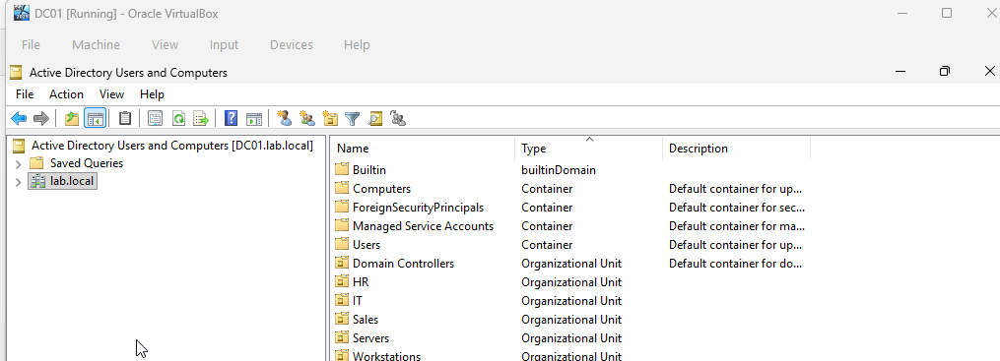
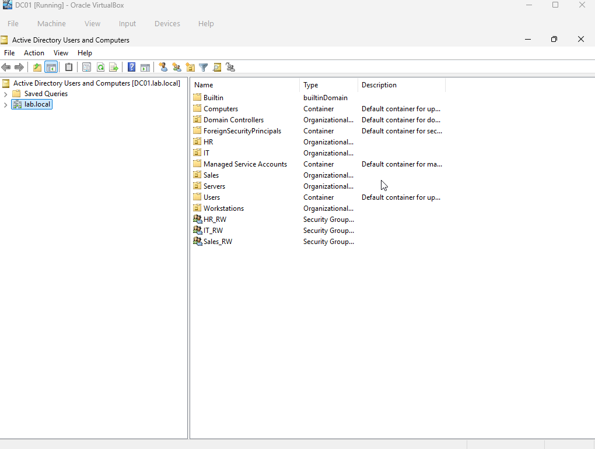
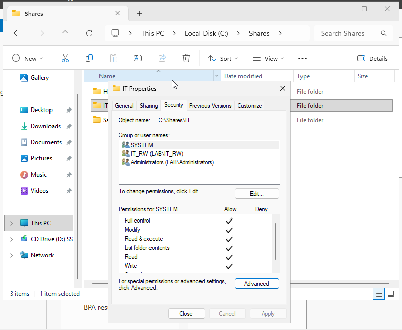

# Active Directory & File Server Lab

## Overview

Built a Windows Server 2022 Active Directory environment integrated with file sharing, NTFS permissions, security groups, and Group Policy.

### Technologies

- Windows Server 2022
- Windows 11
- Active Directory
- Group Policy
- SMB Shares
- NTFS Permissions
- Oracle VirtualBox

---

## Lab Architecture

DC01
- Active Directory
- DNS
- File Server

CLIENT01
- Domain Joined Workstation

Domain:
lab.local

---

# Active Directory Deployment

## Domain Controller

## Domain Join Verification

## Organizational Units

Created:

- HR
- IT
- Sales
- Servers
- Workstations

## Group Policy

Configured:

- Password Complexity Enabled
- Minimum Password Length = 10

## Policy Verification

---

# File Server & NTFS Permissions

## Department Shares

Created:

- HR
- IT
- Sales

## Security Groups

Created:

- HR_RW
- IT_RW
- Sales_RW

## NTFS Permissions

IT_RW assigned Modify access to IT folder.

## SMB Share Permissions

---

# Access Testing

## Authorized Access

User jsmith successfully accessed:

\\DC01\IT

## Unauthorized Access

User denied access to:

\\DC01\HR

---

# Troubleshooting

## Issue: Domain Join Failed

**Cause:** CLIENT01 pointed to incorrect DNS server.

**Fix:** Configured DNS to:

192.168.56.10

---

## Issue: Group Policy Not Applying

**Cause:** CLIENT01 not located in Workstations OU.

**Fix:** Moved workstation to correct OU and ran:

gpupdate /force

---

## Issue: Access Denied to IT Share

**Cause:** Security group membership not refreshed.

**Fix:** Verified using:

whoami /groups

Logged off and back on.

---

# Skills Demonstrated

- Active Directory Administration
- Group Policy Management
- File Server Administration
- NTFS Permissions
- Security Groups
- Access Control
- Windows Server Administration
- Troubleshooting

---

# Author

Brandon Cooper

Cybersecurity | Active Directory | Windows Server | Networking
